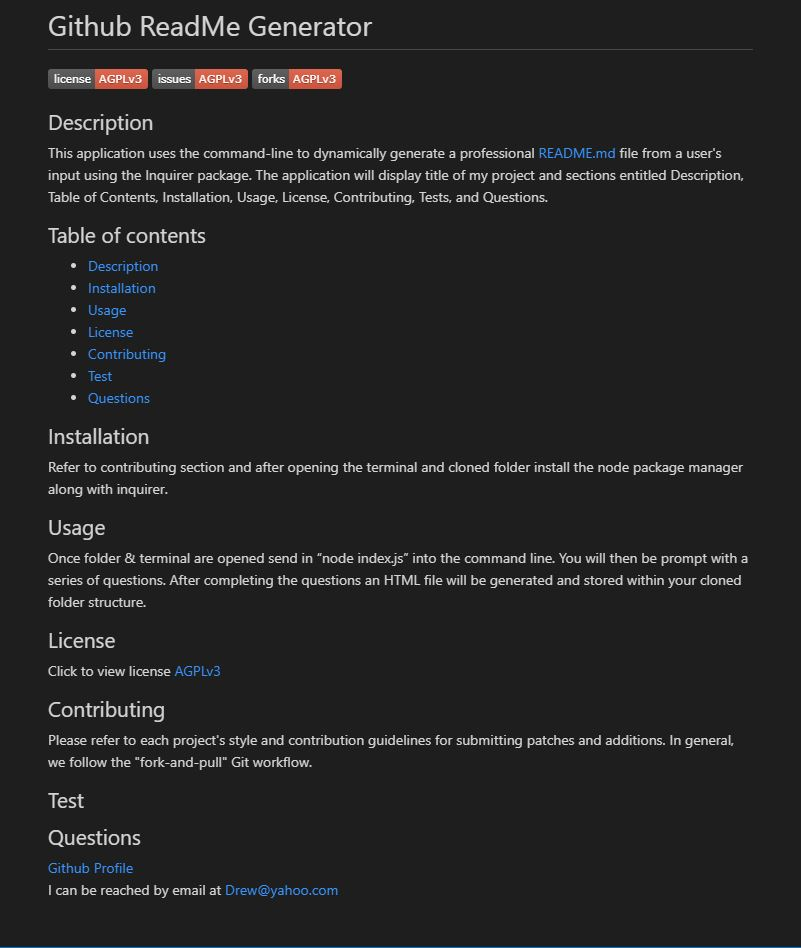

# ReadMe Generator

## Description

This application uses the command-line to dynamically generate a professional README.md file from a user's input using the Inquirer package.  The application will display title of my project and sections entitled Description, Table of Contents, Installation, Usage, License, Contributing, Tests, and Questions.

## Developer 

The application uses HTML, CSS, and JavaScript with jQuery as the JS library.  This is the first application I have created using an AJAX method for making server side API calls.  There are still a couple bugs that need to be worked out.  When clicking on the history list of searches the weather details stacks on top of the previous data instead of replacing it.  I also was not able to get my icons to dynamically update depending on current/future weather conditions.  I did enjoy working with AJAX and look forward to seeing what I will be able to create in the futrue.
 

Link for application: [ReadMe Generator](https://dbridgman1.github.io/Weather-Dashboard/)

## Fucntionality

## Bugs and Issues
Found a bug? Review any [open issues][open-issues] or create a [new issues here][new-issue] so we can fix it for you!

## License
This application does not hold any licenses.

[open-issues]: https://github.com/dbridgman1/ReadMe-Generator/issues
[new-issue]: https://github.com/dbridgman1/ReadMe-Generator/issues/new